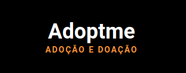

<h3 align="center">
    
    <br><br>
    <p align="center">
        
        
    </p>
</h3>

## 🚀 Sobre
Que tal dá um lar para aquele pet que você viu na rua?! Com a Adotme você consegue fazer isso. Adoptme é uma plataforma feita não somente para ongs, mais também para pessoas que queiram ajudar aquele pet que viu a encontrar um lar amoroso e seguro para ele.

## 👷🏾‍♂️ Como usar?

<h4> Você precisa das seguintes ferramentas instaladas para executar este projeto: </h4>
 <p> <a href="https://nodejs.org/en/">Node.js + NPM<a>, <a href="https://www.postgresql.org/download/"> PostgreSQL </a> e <a href="https://www.electronjs.org/apps/postbird"> Postbird. </a> </p>

```bash
# Faça um clone
$ git clone https://github.com/Jacoappolinario/Adoptme.git

# Navegue até o repositório clonado:
$ cd Adoptme

# Baixe as dependências:
$ npm install

# Configure o banco de dados
sudo -u postgres createdb adoptmedb
sudo -u postgres psql adoptmedb -f Adoptme.sql 

# Obs: Você também pode importar manualmente o adoptme.sql para o Postbird.
```
Adicione as credenciais de acesso ao banco de dados no arquivo src / config / db.js.

```bash
# Divirta-se
$ npm start
```

## 📕 Licença
Lançado em 2021 (Trabalho em andamento) Esse projeto está sob a licença MIT. Veja o arquivo [LICENSE](/LICENSE) para mais detalhes.

---

Feito com 💙 by [Jacó Apolinário](https://www.linkedin.com/in/jacoapolinario/)
